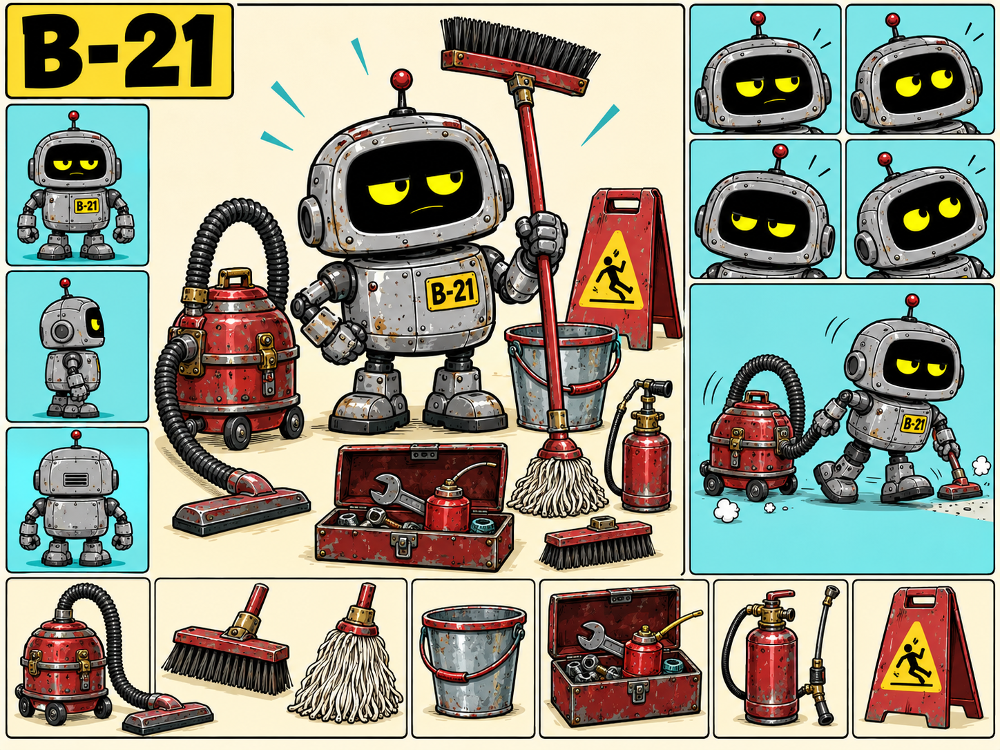

# Character Design — B-21

- Character ID: B-21
- Stand: 2026-09-16 · Version: v1 (Bestandsdokumentation)
- Design state: EXPLORATION; keine neue Auswahl oder Freigabe durch die Harmonisierung.
- Narrative Quelle: [Charakterprofil](../../../characters/b-21/profile.md).
- Bildsprache: [Projektkonfiguration](../../../design-project.md); kein projektweit freigegebener Style Pack.

## Visuelle Arbeitsgrundlage

Klein, breit und gedrungen; graues vernietetes Gehäuse, gelbe Augen auf schwarzer Fläche, rote Antennenspitze, sichtbare Reparaturen und leichte Rostspuren. Gelbes Kennschild B-21; Werkzeuge überwiegend rot-metallisch.

## Referenzbestand

| Datei | Inhalt | Bildstatus |
|---|---|---|
| [b21-01.png](references/b21-01.png) | Layoutblatt mit Ansichten, Mimik und separatem Wartungsequipment. | EXPLORATION |
| [b21-02.png](references/b21-02.png) | Einzelne Ganzfigur mit gut lesbaren Gehäuse- und Gesichtsdetails. | EXPLORATION |

Dateinummern dokumentieren Varianten, keine Rangfolge oder Freigabe. Vorhandene Bilder wurden unverändert verschoben. Originale Generierungsprompts und genaue Entstehungsdaten sind im untersuchten Bestand nicht dokumentiert; es werden keine nachträglichen Prompts als Original ausgegeben. Herkunft und Prüfsummen: [Migrationsmanifest](../migration-2026-09-16.json).

## Abgleich mit dem Charakterprofil

Bauform, gelbe Augen, Gebrauchsspuren und Kennung sind bereits im Profil beschrieben. Die bildliche Ausarbeitung erhält dadurch keine automatische Freigabe. Werkzeuge werden getragen oder von Hand montiert; kein integriertes Modulsystem wie bei B-73.

Narrative Zustände CANON / INFERENCE / PROPOSAL / OPEN im Profil bleiben erhalten. Ein sichtbares Detail ist ohne eigene Bestätigung keine neue Welt- oder Biografieregel.

## Offene Ausarbeitung

Proportionen und Werkzeugmaßstab zwischen Ganzfigur und Layoutblatt abgleichen; erfahrenen prüfenden Blick nicht pauschal als Traurigkeit darstellen.

## Verknüpfungen

[Charakterübersicht](../../../characters/README.md) · [Designübersicht](../README.md) · [Ensemble-Stilreferenz](../../references/figurenlayout-v1.png)
