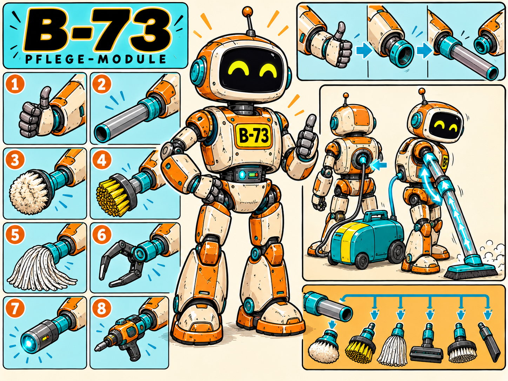

# Character Design — B-73

- Character ID: B-73
- Stand: 2026-09-16 · Version: v1 (Bestandsdokumentation)
- Design state: EXPLORATION; keine neue Auswahl oder Freigabe durch die Harmonisierung.
- Narrative Quelle: [Charakterprofil](../../../characters/b-73/profile.md).
- Bildsprache: [Projektkonfiguration](../../../design-project.md); kein projektweit freigegebener Style Pack.

## Visuelle Arbeitsgrundlage

Groß, kräftig und aufrecht; orange-cremefarbenes Gehäuse, türkise Gelenke und Funktionsanschlüsse, schwarze Gesichtsfläche mit gelben Augen. Kennschild B-73, freundliche wache Haltung und sparsame Nutzungsspuren.

## Referenzbestand

| Datei | Inhalt | Bildstatus |
|---|---|---|
| [b73-01.png](references/b73-01.png) | Layoutblatt des modularen Pflegeequipments mit Funktionsdarstellungen. | EXPLORATION |
| [b73-02.png](references/b73-02.png) | Einzelne Ganzfigur mit orange-cremefarbenem Gehäuse und türkisen Anschlüssen. | EXPLORATION |

Dateinummern dokumentieren Varianten, keine Rangfolge oder Freigabe. Vorhandene Bilder wurden unverändert verschoben. Originale Generierungsprompts und genaue Entstehungsdaten sind im untersuchten Bestand nicht dokumentiert; es werden keine nachträglichen Prompts als Original ausgegeben. Herkunft und Prüfsummen: [Migrationsmanifest](../migration-2026-09-16.json).

## Abgleich mit dem Charakterprofil

Bauform und Farbkonzept sind im Profil beschrieben. Hände fahren für den Werkzeugwechsel ein; Kupplungen nehmen Module direkt auf. Der Sauger hängt am Rückenanschluss und verwendet das Universalrohr am Arm, kein eigenes zusätzliches Saugrohr.

Narrative Zustände CANON / INFERENCE / PROPOSAL / OPEN im Profil bleiben erhalten. Ein sichtbares Detail ist ohne eigene Bestätigung keine neue Welt- oder Biografieregel.

## Offene Ausarbeitung

Werkzeugkupplungen, Schlauchführung und Handwechsel für wiederkehrende Panels konsistent ausarbeiten.

## Verknüpfungen

[Charakterübersicht](../../../characters/README.md) · [Designübersicht](../README.md) · [Ensemble-Stilreferenz](../../references/figurenlayout-v1.png)
