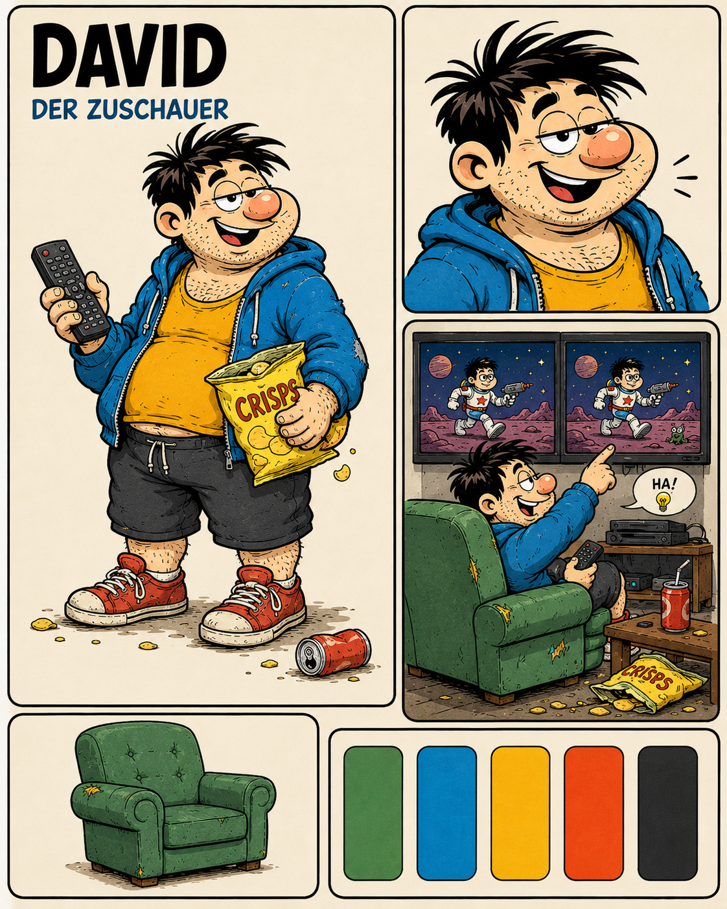

# Character Design — David

- Character ID: DAVID
- Stand: 2026-09-16 · Version: v1 (Bestandsdokumentation)
- Design state: EXPLORATION; keine neue Auswahl oder Freigabe durch die Harmonisierung.
- Narrative Quelle: [Charakterprofil](../../../characters/david/profile.md).
- Bildsprache: [Projektkonfiguration](../../../design-project.md); kein projektweit freigegebener Style Pack.

## Visuelle Arbeitsgrundlage

Kräftiger rundlicher Körper, zerzaustes dunkles Haar, Stoppeln und auffällige runde Nase. Entspannte, provokante oder erschöpfte Mimik je nach Studie. Unterschiedliche Bekleidungs- und Situationsvarianten; keine als endgültige Standardkleidung gewählt.

## Referenzbestand

| Datei | Inhalt | Bildstatus |
|---|---|---|
| [david-01.png](references/david-01.png) | Layoutblatt: blauer Hoodie, gelbes Shirt, dunkle Shorts, rote Schuhe; Medien- und Sesselmotive. | EXPLORATION |
| [david-02.png](references/david-02.png) | Sitzende Szenenstudie im grünen Sessel, ohne Oberteil, mit Snacks und Getränk. | EXPLORATION |
| [david-03.png](references/david-03.png) | Frontale Körper-/Mimikstudie in blauen Shorts mit roten Sternen. | EXPLORATION |

Dateinummern dokumentieren Varianten, keine Rangfolge oder Freigabe. Vorhandene Bilder wurden unverändert verschoben. Originale Generierungsprompts und genaue Entstehungsdaten sind im untersuchten Bestand nicht dokumentiert; es werden keine nachträglichen Prompts als Original ausgegeben. Herkunft und Prüfsummen: [Migrationsmanifest](../migration-2026-09-16.json).

## Abgleich mit dem Charakterprofil

Das narrative Erscheinungsbild ist weiterhin OPEN. Vorhandene Bilder ergänzen die textliche Leerstelle als Entwürfe. Geschlecht, Alter und Herkunft werden nicht aus der Darstellung festgeschrieben. Medienkonsum im Profil ist mit Angst verbunden; die Snack-/Sesselmotive reduzieren den Charakter nicht auf einen Gag.

Narrative Zustände CANON / INFERENCE / PROPOSAL / OPEN im Profil bleiben erhalten. Ein sichtbares Detail ist ohne eigene Bestätigung keine neue Welt- oder Biografieregel.

## Offene Ausarbeitung

Drei Varianten hinsichtlich Körperproportionen und Kleidung abstimmen; auswählen, welche Ansicht für welchen erzählerischen Zustand gelten soll.

## Verknüpfungen

[Charakterübersicht](../../../characters/README.md) · [Designübersicht](../README.md) · [Ensemble-Stilreferenz](../../references/figurenlayout-v1.png)
