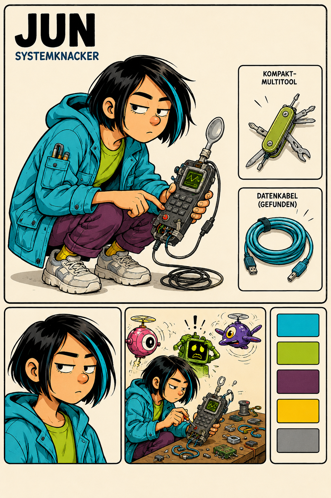

# Character Design — Jun

- Character ID: JUN
- Stand: 2026-09-16 · Version: v1 (Bestandsdokumentation)
- Design state: EXPLORATION; keine neue Auswahl oder Freigabe durch die Harmonisierung.
- Narrative Quelle: [Charakterprofil](../../../characters/jun/profile.md).
- Bildsprache: [Projektkonfiguration](../../../design-project.md); kein projektweit freigegebener Style Pack.

## Visuelle Arbeitsgrundlage

Dunkler kurzer Bob mit türkiser Strähne, konzentrierter seitlicher Blick. Türkise Jacke, limettengrünes Oberteil, violette Hose, helle Turnschuhe. Hockende, auf ein improvisiertes Gerät konzentrierte Haltung.

## Referenzbestand

| Datei | Inhalt | Bildstatus |
|---|---|---|
| [jun-01.png](references/jun-01.png) | Layoutblatt mit Techniksituation, Porträt, Multitool, Kabel und Palette. | EXPLORATION |

Dateinummern dokumentieren Varianten, keine Rangfolge oder Freigabe. Vorhandene Bilder wurden unverändert verschoben. Originale Generierungsprompts und genaue Entstehungsdaten sind im untersuchten Bestand nicht dokumentiert; es werden keine nachträglichen Prompts als Original ausgegeben. Herkunft und Prüfsummen: [Migrationsmanifest](../migration-2026-09-16.json).

## Abgleich mit dem Charakterprofil

Aussehen, Geschlecht und Alter bleiben im Profil offen; die Bildmerkmale sind Entwürfe. Werkzeug, Kabelstecker und kleine Roboter im Blatt sind keine automatisch bestätigten Welttechnik- oder Figurenentscheidungen. „Systemknacker“ bleibt eine Bildüberschrift, kein gesicherter Beiname.

Narrative Zustände CANON / INFERENCE / PROPOSAL / OPEN im Profil bleiben erhalten. Ein sichtbares Detail ist ohne eigene Bestätigung keine neue Welt- oder Biografieregel.

## Offene Ausarbeitung

Aufrechte Ganzfigur und weitere Ansichten entwickeln; konkrete Werkzeuge auf die jeweilige Skriptsituation abstimmen.

## Verknüpfungen

[Charakterübersicht](../../../characters/README.md) · [Designübersicht](../README.md) · [Ensemble-Stilreferenz](../../references/figurenlayout-v1.png)
