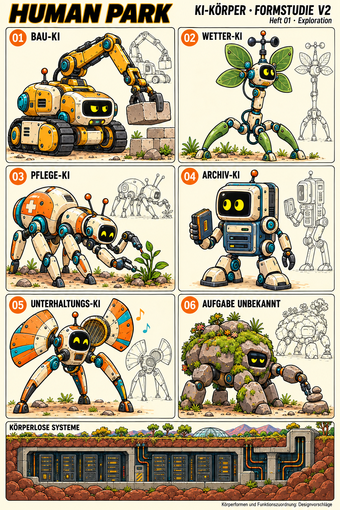
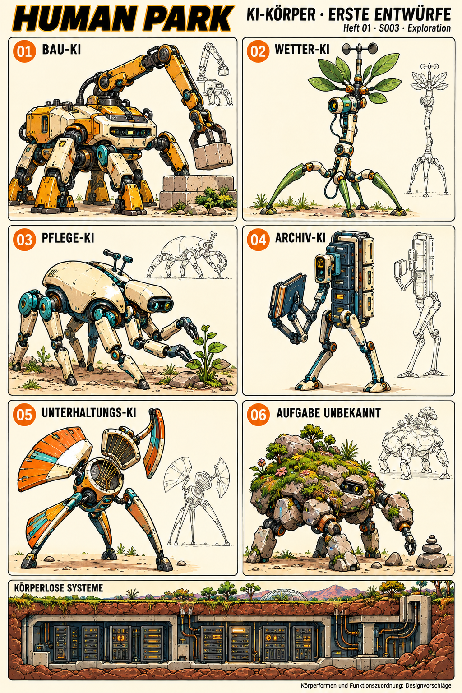

# Character Design — KI-Körperformen

- Design ID: ki-koerperformen
- Stand: 2026-09-16 · Version: v2
- Design state: EXPLORATION
- Bevorzugte Arbeitsrichtung: V2, vom Autor positiv bewertet („Ja, viel besser!“); keine finale Produktionsfreigabe.
- Narrative status: CANON für die im Originaltext genannten Aufgaben und Erscheinungsformen; PROPOSAL für konkrete Körper und ihre Zuordnung zu Aufgaben.

## Quellen und Auftrag

[Storyboard Heft 1](../../../issues/issue-001/storyboard.md), S003-P01/P02, und [Originalskript](../../../issues/issue-001/script.md): KIs existieren in unterirdischen Rechenzentren oder mobilen Körpern, die Maschinen, Pflanzen, Tieren und wandelnden Landschaftselementen ähneln. Genannt werden Bau-, Wetter-, Pflege-, Archiv- und Unterhaltungs-KIs sowie KIs unbekannter ursprünglicher Aufgabe.

Die Entwurfsseite visualisiert diese Vielfalt. Der Autor befürwortete besonders die pflanzliche Wetter-KI, eine ameisen-/spinnenartige Pflege-KI, die computerartige Archiv-KI und die Kran-/Baggerform der Bau-KI. Diese Richtungen wurden in V2 mit den vorhandenen Charakterreferenzen abgeglichen.

## V2 — bevorzugte Arbeitsrichtung

| Typ | Konkreter Entwurf |
|---|---|
| Bau-KI | Kompakter Bagger-/Krankörper mit Kettenfahrwerk, Ausleger und Greifer |
| Wetter-KI | Bewegliche technische Pflanze mit Blattflächen, Windmesser und wurzelartigen Beinen |
| Pflege-KI | Gegliederter ameisen-/spinnenartiger Körper mit mehreren Laufbeinen und separaten Pflegewerkzeugen |
| Archiv-KI | Laufender Computer mit Monitorform, Laufwerken, Armen und Füßen |
| Unterhaltungs-KI | Dreibeiniger Klangkörper mit beweglichen fächerartigen Flächen |
| Aufgabe unbekannt | Wandelndes Landschaftselement aus Steinflächen und Vegetation mit kleinem Manipulator |
| Körperlose Systeme | Ergänzende Vignette unterirdischer Rechenzentren, kein mobiler Körper |

Die konkreten Zuordnungen sind Designvorschläge und keine vollständige oder verbindliche Taxonomie. Die Pflege-KI ersetzt B-73 nicht. Das Landschaftselement erhält durch seine dargestellte Tätigkeit keine erklärte ursprüngliche Aufgabe.

## Formensprache und Referenzen

[Modulia](../modulia/references/modulia-01.png), [B-21](../b-21/references/b21-01.png), [B-73](../b-73/references/b73-02.png) und [Projektkonfiguration](../../../design-project.md): kräftige Konturen, grafische Schatten, klare Farben und funktionale Technik mit Nutzungsspuren. V2 vereinfacht die Mechanik und verwendet rundere Gehäuse und kräftigere Gelenke.

V2s gelbe Augen auf schwarzen Flächen orientieren sich hauptsächlich an B-21/B-73. **Modulias weiße Augen mit schwarzen Pupillen sind ein anderer zulässiger Gesichtstyp.** Die gelben Displayaugen werden nicht zur universellen Regel für KIs erklärt. Aus Körperform oder Augenfarbe folgt kein Rang oder Personenstatus; der bestehende [Konflikt zur Funktionsklassen-Doktrin](../../../canon/world-rules.md) bleibt unberührt.

## V1 — erste Exploration

Erster, stärker technisch detaillierter Entwurf. Grundlage für die vom Autor gewünschte Annäherung an die bestehenden Figuren. Als Entwicklungshistorie erhalten; V2 ist die bevorzugte Arbeitsrichtung.

## Bildbestand und Herkunft

| Fassung | Bild | Vollständiger Prompt | Ursprüngliche Notizen |
|---|---|---|---|
| V1 | [PNG](references/ki-layouts-v1.png) | [Prompt](references/ki-layouts-v1-prompt.txt) | [Notizen](references/ki-layouts-v1-notes.md) |
| V2 | [PNG](references/ki-layouts-v2.png) | [Prompt](references/ki-layouts-v2-prompt.txt) | [Notizen](references/ki-layouts-v2-notes.md) |

Erzeugt mit dem integrierten Imagegen-Werkzeug. [Importmanifest](references/intake-manifest.json) enthält Herkunft und SHA-256-Prüfsummen. Die ursprünglichen Notizen dokumentieren den damaligen Arbeitsstand; diese Designakte führt den aktuellen Status.

## Weitere Rollenstudien

Das spätere gemeinsame Blatt für Forschungs-, Verwaltungs- und Ordnungs-KIs ist bereits bei [Normans Designhistorie](../norman/design.md) abgelegt. Es wurde vom Autor als zu eintönig und zu weit von Modulia entfernt beurteilt; diese Kritik bezieht sich auf das spätere Rollenblatt und hebt die positive Bewertung der hier dokumentierten V2 nicht auf.

## Offene Ausarbeitung

Einzelfiguren, Namen, Maße, genaue Gelenkgeometrie und konsistente Ansichten bleiben offen. Die kleinen Seitenstudien sind Entwurfszeichnungen, keine geprüften Produktionsmodelle. Weitere Augen-, Farb- und Formvarianten sind möglich. Bestehende Skripte und Figurenprofile werden durch diese Ablage nicht geändert.
