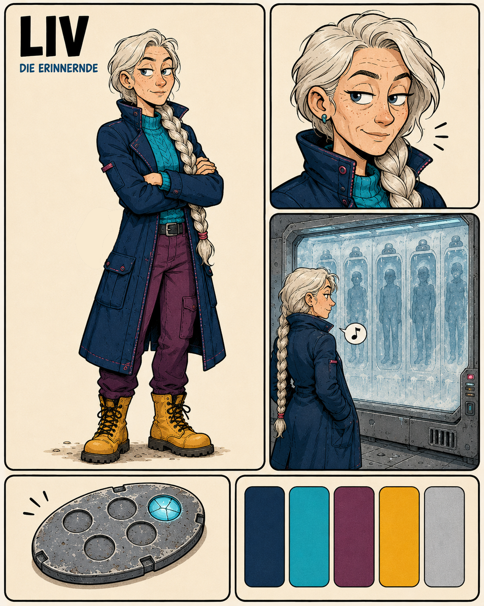

# Character Design — Liv

- Character ID: LIV
- Stand: 2026-09-16 · Version: v1 (Bestandsdokumentation)
- Design state: EXPLORATION; keine neue Auswahl oder Freigabe durch die Harmonisierung.
- Narrative Quelle: [Charakterprofil](../../../characters/liv/profile.md).
- Bildsprache: [Projektkonfiguration](../../../design-project.md); kein projektweit freigegebener Style Pack.

## Visuelle Arbeitsgrundlage

Sehr langes silberweißes Haar im Zopf, Sommersprossen, feine Gesichtslinien und ruhiger seitlicher Blick. Dunkelblauer Mantel, türkiser Pullover, burgunderfarbene Hose und ockerfarbene Stiefel; kleine türkise Ohrstecker.

## Referenzbestand

| Datei | Inhalt | Bildstatus |
|---|---|---|
| [liv-01.png](references/liv-01.png) | Layoutblatt mit Ganzfigur, Gesicht, Szenenmotiv, ovalem Objekt und Palette. | EXPLORATION |
| [liv-02b.png](references/liv-02b.png) | Einzelne Ganzfigur mit langem Zopf und verschränkten Armen. | EXPLORATION |

Dateinummern dokumentieren Varianten, keine Rangfolge oder Freigabe. Vorhandene Bilder wurden unverändert verschoben. Originale Generierungsprompts und genaue Entstehungsdaten sind im untersuchten Bestand nicht dokumentiert; es werden keine nachträglichen Prompts als Original ausgegeben. Herkunft und Prüfsummen: [Migrationsmanifest](../migration-2026-09-16.json).

## Abgleich mit dem Charakterprofil

Das Profil beschreibt diese visuelle Arbeitsrichtung bereits ausführlich; diese Akte verknüpft den Bildbestand, ohne sie neu zu bewerten. Silberweißes Haar bestimmt kein biologisches Alter. Bedeutung des ovalen Objekts und der illustrierten Hintergrundszene nicht aus dem Bild ableiten.

Narrative Zustände CANON / INFERENCE / PROPOSAL / OPEN im Profil bleiben erhalten. Ein sichtbares Detail ist ohne eigene Bestätigung keine neue Welt- oder Biografieregel.

## Offene Ausarbeitung

Zopfverlauf, Manteldetails und Proportionen in weiteren Ansichten abgleichen; Herkunft und Bedeutung des Objekts bleiben an die offenen Profilpunkte gebunden.

## Verknüpfungen

[Charakterübersicht](../../../characters/README.md) · [Designübersicht](../README.md) · [Ensemble-Stilreferenz](../../references/figurenlayout-v1.png)
