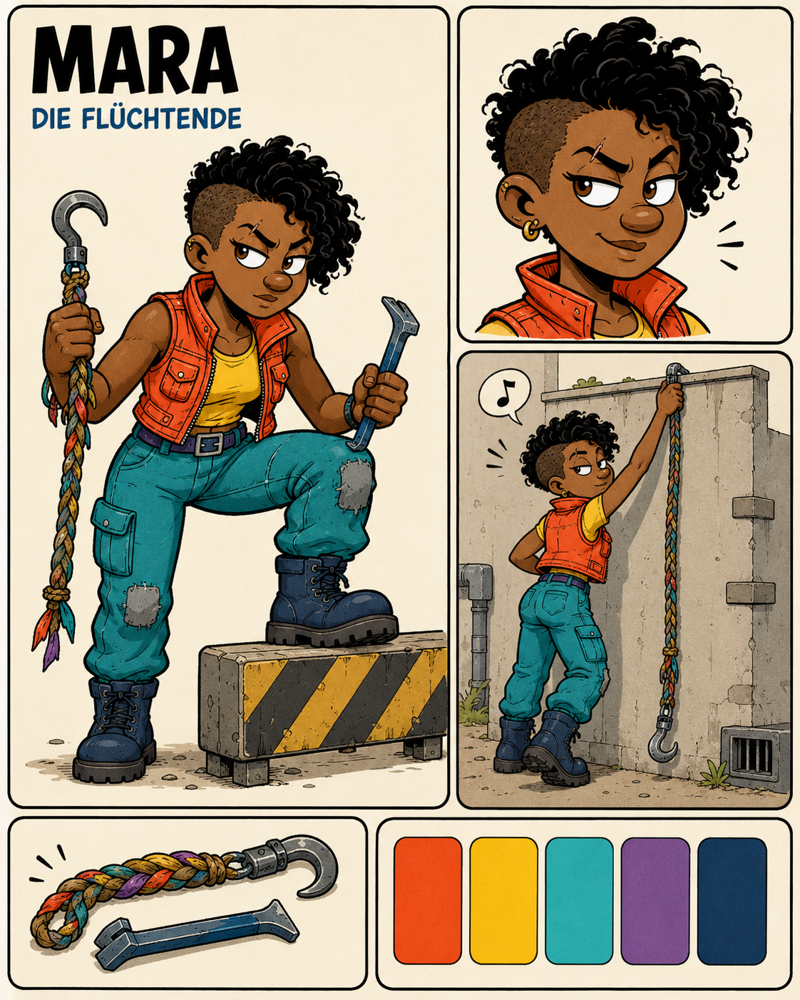

# Character Design — Mara

- Character ID: MARA
- Stand: 2026-09-16 · Version: v1 (Bestandsdokumentation)
- Design state: EXPLORATION; keine neue Auswahl oder Freigabe durch die Harmonisierung.
- Narrative Quelle: [Charakterprofil](../../../characters/mara/profile.md).
- Bildsprache: [Projektkonfiguration](../../../design-project.md); kein projektweit freigegebener Style Pack.

## Visuelle Arbeitsgrundlage

Dunkle asymmetrische Lockenfrisur mit kurz geschorener Seite; warme braune Haut, markante Brauen, kleine sichtbare Stirnnarbe und Ohrschmuck. Orange Weste, gelbes Oberteil, türkise geflickte Cargohose und dunkle Stiefel. Entschlossene Körpersprache.

## Referenzbestand

| Datei | Inhalt | Bildstatus |
|---|---|---|
| [mara-01.png](references/mara-01.png) | Layoutblatt mit Ganzfigur, Gesicht, Fluchtsituation, Requisiten und Farbpalette. | EXPLORATION |

Dateinummern dokumentieren Varianten, keine Rangfolge oder Freigabe. Vorhandene Bilder wurden unverändert verschoben. Originale Generierungsprompts und genaue Entstehungsdaten sind im untersuchten Bestand nicht dokumentiert; es werden keine nachträglichen Prompts als Original ausgegeben. Herkunft und Prüfsummen: [Migrationsmanifest](../migration-2026-09-16.json).

## Abgleich mit dem Charakterprofil

Dunkle Haare sind im Profil CANON. Frisur, Kleidung, Narbe, Schmuck und konkrete Werkzeuge sind visuelle Vorschläge. Die Szene und der Titel „Die Flüchtende“ etablieren keine zusätzliche Handlung oder innerweltliche Bezeichnung.

Narrative Zustände CANON / INFERENCE / PROPOSAL / OPEN im Profil bleiben erhalten. Ein sichtbares Detail ist ohne eigene Bestätigung keine neue Welt- oder Biografieregel.

## Offene Ausarbeitung

Ganzkörperansichten und Hand-/Werkzeugkontinuität entwickeln; Alter, Maße und finale Auswahl bleiben offen.

## Verknüpfungen

[Charakterübersicht](../../../characters/README.md) · [Designübersicht](../README.md) · [Ensemble-Stilreferenz](../../references/figurenlayout-v1.png)
