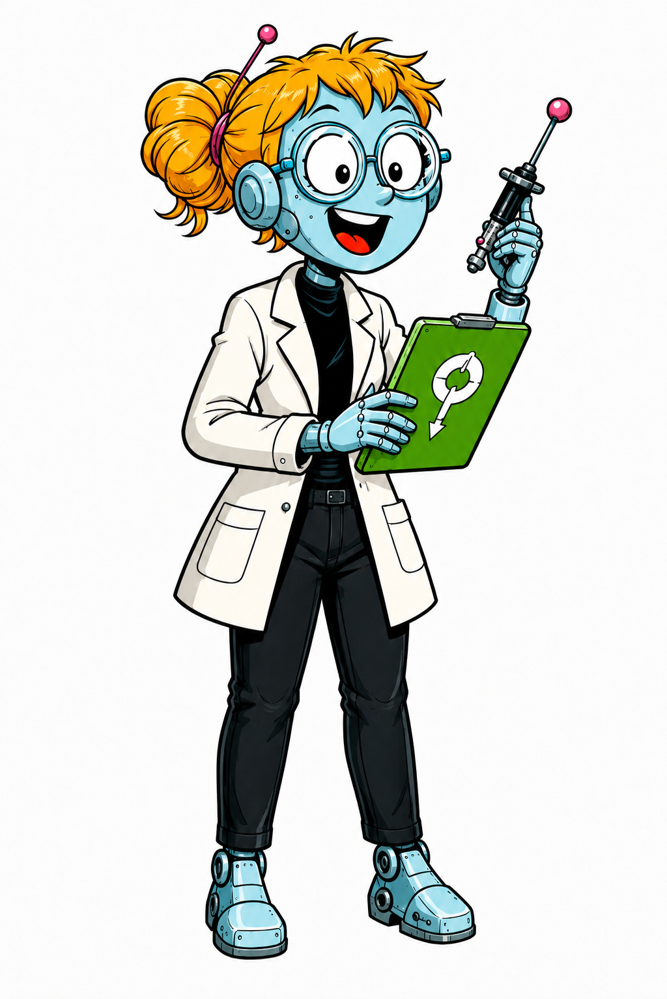

# Character Design — Modulia

- Character ID: MODULIA
- Stand: 2026-09-16 · Version: v1 (Bestandsdokumentation)
- Design state: EXPLORATION; keine neue Auswahl oder Freigabe durch die Harmonisierung.
- Narrative Quelle: [Charakterprofil](../../../characters/modulia/profile.md).
- Bildsprache: [Projektkonfiguration](../../../design-project.md); kein projektweit freigegebener Style Pack.

## Visuelle Arbeitsgrundlage

Türkisfarbener humanoider Metallkörper; große weiße Augen mit schwarzen Pupillen hinter runder Brille; orangefarbenes Haar mit gebündelter Frisur. Weißer Kittel, schwarze Hose, schwarze Hals-/Gelenkpartien. Neugierige, offene Mimik.

## Referenzbestand

| Datei | Inhalt | Bildstatus |
|---|---|---|
| [modulia-01.png](references/modulia-01.png) | Ganzfigur mit Brille, weißem Kittel, grünem Klemmbrett und Handinstrument. | EXPLORATION |

Dateinummern dokumentieren Varianten, keine Rangfolge oder Freigabe. Vorhandene Bilder wurden unverändert verschoben. Originale Generierungsprompts und genaue Entstehungsdaten sind im untersuchten Bestand nicht dokumentiert; es werden keine nachträglichen Prompts als Original ausgegeben. Herkunft und Prüfsummen: [Migrationsmanifest](../migration-2026-09-16.json).

## Abgleich mit dem Charakterprofil

Das Profil legt die mobile Erscheinung fest, lässt das genaue Körperdesign aber OPEN. Die Bildreferenz ist eine Arbeitsdarstellung, keine neue Kanonfestlegung. Augenform ist kein Rang- oder Personenstatuszeichen.

Narrative Zustände CANON / INFERENCE / PROPOSAL / OPEN im Profil bleiben erhalten. Ein sichtbares Detail ist ohne eigene Bestätigung keine neue Welt- oder Biografieregel.

## Offene Ausarbeitung

Seiten-/Rückenansicht, Größenverhältnis und reproduzierbare Gesichts-/Gelenkdetails ausarbeiten.

## Verknüpfungen

[Charakterübersicht](../../../characters/README.md) · [Designübersicht](../README.md) · [Ensemble-Stilreferenz](../../references/figurenlayout-v1.png)
