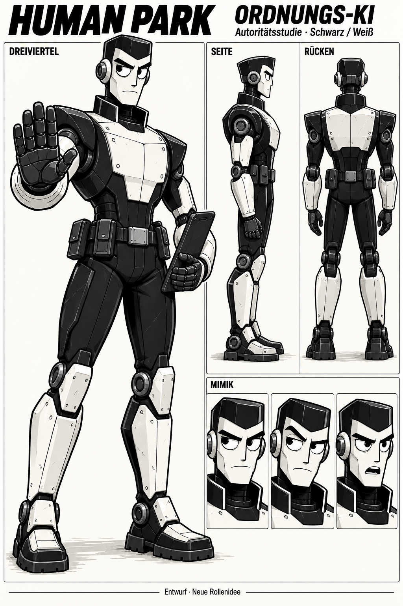

# Character Design — Norman

- Character ID: NORMAN
- Version: v1 · Stand: 2026-09-16
- Design state: EXPLORATION
- Bevorzugte Arbeitsrichtung: autoritärer Schwarz-Weiß-Entwurf, vom Autor positiv bewertet; nicht APPROVED oder LOCKED.
- Narrative Quelle: [Charakterprofil](../../../characters/norman/profile.md).
- Kein projektweit freigegebener Style Pack; [Projektkonfiguration](../../../design-project.md).

## Designziel

Eine deutlich autoritäre Ordnungs-KI in der Bildwelt von Human Park. Schwarze und weiße Gehäuseflächen bilden die Grundpalette. Die Gesichtsausarbeitung orientiert sich an [Modulia](../modulia/references/modulia-01.png): sichtbare weiße Augen mit schwarzen Pupillen, bewegliche Lider, Brauen, Nase und Mund. Individuelle strenge Mimik statt einer generischen lächelnden Displayfläche.

Die technische Verwandtschaft zu [B-21](../b-21/references/b21-01.png) und [B-73](../b-73/references/b73-02.png) entsteht durch wartbare Gehäuse, Gelenke und Gebrauchsspuren. Norman erhält eigene Proportionen und eine kantigere Silhouette.

## Aktuelle Referenz

**EXPLORATION — bevorzugte Arbeitsrichtung.** Dreiviertel-, Seiten- und Rückenansicht sowie drei Mimikstudien. Schwarze Gehäuseflächen, weiße Platten, kantiger Kiefer, breite Schultern, kontrollierte Stopp-Geste und Tablet. Das Blatt wurde vor Namenswahl und Rangabzeichen-Idee erzeugt und trägt daher noch den Titel „Ordnungs-KI“.

### Kontinuitätsanker für weitere Entwürfe

- Längliches weißes Metallgesicht, markanter Kiefer und schwarze Brauen.
- Weiße Augäpfel und schwarze Pupillen; keine gelben Displayaugen.
- Breite schwarze Schultern, hohe Kragenform, weiße Brustfläche.
- Schwarze Hände, weiße Unterarme und Unterschenkel, robuste Füße.
- Ruhige, prüfende Autorität; Gesten sparsam und eindeutig.

Maße, exakte Panelteilung und Gelenkgeometrie sind noch nicht als Produktionsmodell festgelegt.

## Nachfolgender Autorenwunsch: Rangabzeichen

Gelbe bzw. leuchtende Abzeichen geben den Rang an. Diese Ergänzung ist **noch nicht im Bild umgesetzt**. Schwarz-Weiß bleibt die Körperpalette, Gelb wird ein gezielter funktionaler Akzent. Vorgeschlagene Platzierung: Brust oder Schulter, in wichtigen Ansichten klar erkennbar; konkrete Position noch OPEN.

Rang und Modellfähigkeit, Wissenszugriff sowie Entscheidungsspielraum sind im [Profil](../../../characters/norman/profile.md) beschrieben. Zwei Balken für Norman und das vierstufige Zeichensystem bleiben PROPOSAL. Keine neue Augenfarbe aus dem Abzeichen ableiten.

## Entwurfshistorie und Dateien

| Datei | Inhalt und Verwendung |
|---|---|
| [norman-schwarz-weiss-v1.png](references/norman-schwarz-weiss-v1.png) | Aktuelle bevorzugte Arbeitsrichtung; EXPLORATION, keine finale Freigabe. |
| [norman-schwarz-weiss-v1-prompt.txt](references/norman-schwarz-weiss-v1-prompt.txt) | Vollständiger Imagegen-Auftrag der Einzelstudie. |
| [rollenstudien-v1.png](references/rollenstudien-v1.png) | Frühes gemeinsames Blatt: Forschung, Verwaltung, Ordnung. Vom Autor als zu eintönig und zu weit von Modulia entfernt beurteilt. Nur Entstehungsgeschichte; nicht als aktive Norman-Referenz benutzen. |
| [rollenstudien-v1-prompt.txt](references/rollenstudien-v1-prompt.txt) | Vollständiger Generierungsauftrag des frühen Blatts. |
| [intake-manifest.json](references/intake-manifest.json) | Herkunft und SHA-256 der importierten Bilder und Prompts. |

Beide Bildentwürfe wurden mit dem integrierten Imagegen-Werkzeug erstellt. Der gemeinsame Vorentwurf legt weder Norman als rollende Figur noch neue Forschungs-/Verwaltungsfiguren verbindlich fest.

## Nächster Schritt

Normans Rang und Kennung entscheiden; gelbe Rangabzeichen in einer neuen Bildversion erproben. Anschließend Ansichten, Mimik und Größenverhältnis zu Modulia prüfen. Bestehende Entwürfe behalten; keine automatische finale Designfreigabe.
