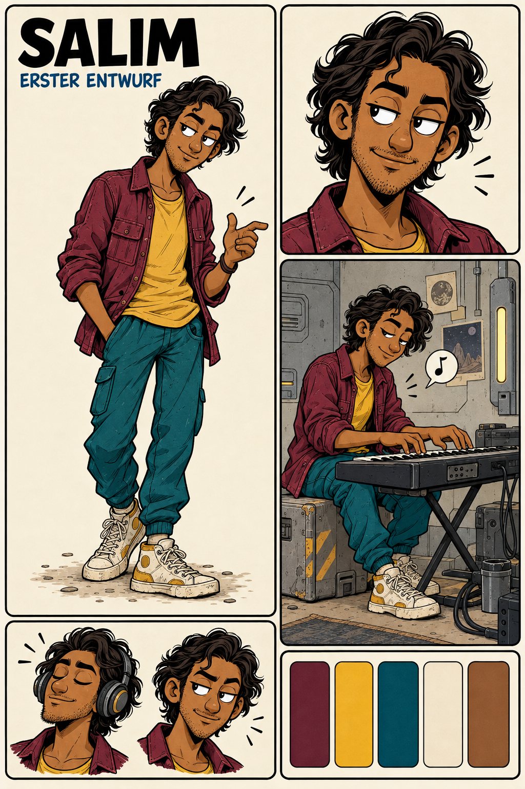

# Character Design — Salim

- Character ID: SALIM
- Stand: 2026-09-18 · Version: v2
- Design state: SELECTED — erster Entwurf vom Autor am 2026-09-18 übernommen.
- Narrative Quelle: [Charakterprofil](../../../characters/salim/profile.md).
- Bildsprache: [Projektkonfiguration](../../../design-project.md).

## Ausgewählte Arbeitsrichtung

Schlanke, bewegliche erwachsene Figur mit warmer mittelbrauner Haut, dunklem gewelltem Haar, dezenter Bartzeichnung und aufmerksamem seitlichem Blick. Schmale Gesichtssilhouette, ausdrucksstarke Brauen und ein spielerisches halbes Lächeln. Burgunderfarbenes Überhemd mit hochgeschobenen Ärmeln, ockerfarbenes Shirt, petrolfarbene Cargohose und cremefarbene Turnschuhe mit Ockerakzenten. Lockere, asymmetrische Haltung mit rhythmischer Handgeste.

## Referenzbestand und Auswahl

| Datei | Inhalt | Bildstatus |
|---|---|---|
| [salim-entwurf-v1.png](references/salim-entwurf-v1.png) | Figurenblatt mit Ganzfigur, Porträt, Keyboard-Szene, zwei Mimikstudien und Palette. | SELECTED |

Erzeugt am 2026-09-18 mit dem integrierten Imagegen-Tool auf Grundlage der Figurenblätter von Mara, Jun, Liv und David. [Originale Entwurfsnotizen und Prompt](references/salim-entwurf-v1-notes.md); [Importmanifest](references/intake-manifest.json).

Autorenentscheidung: „Übernimm den Entwurf und speichere ihn ab.“ Der Entwurf ist damit als visuelle Arbeitsrichtung ausgewählt. Der ursprüngliche EXPLORATION-Vermerk in den Generierungsnotizen dokumentiert den Entstehungsstand; aktueller Status ist SELECTED. Keine finale Produktionssperre (LOCKED).

## Abgleich mit dem Charakterprofil

Musik, soziale Beobachtung und spielerische Kommunikation folgen dem Profil. Das ausgewählte Erscheinungsbild ist die visuelle Arbeitsgrundlage. Konkretes Alter, Geschlechtsidentität, Herkunft und früherer Beruf bleiben narrativ OPEN. Keyboard und Kopfhörer sind szenische Designrequisiten; sie bestätigen weder Lieblingsinstrument noch professionelle Musikausbildung. Hintergrunddetails etablieren keine neue Raum- oder Weltregel.

## Nächste Ausarbeitung

Bei Bedarf Seiten- und Rückenansichten sowie Handgesten ergänzen; Frisur, Proportionen und Kleidung anhand dieses Blattes konsistent halten.

## Verknüpfungen

[Charakterübersicht](../../../characters/README.md) · [Designübersicht](../README.md) · [Ensemble-Stilreferenz](../../references/figurenlayout-v1.png)
