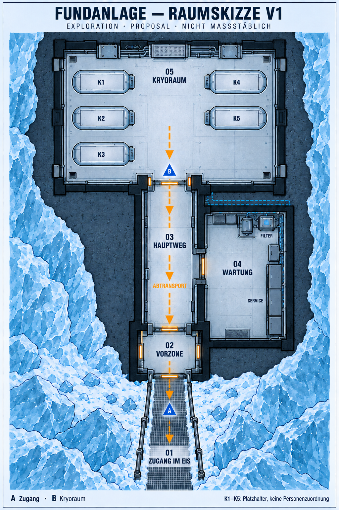

> Importiertes Entstehungsprotokoll vom 2026-09-14. Zeitgebundene Aussagen wie „noch nicht im Repo“ beschreiben den damaligen Stand. Aktuelle Auswahl und Handoffs stehen in den Designakten. Lokale Links wurden bei der Übernahme angepasst; Prompts bleiben inhaltlich erhalten.

# Fundanlage — Raumkonzept v1

> Environment ID: earth-discovery-facility  
> Designstatus: EXPLORATION  
> Neue räumliche Aussagen: PROPOSAL  
> Maßstab: schematisch, nicht maßstäblich  
> Stilgrundlage: Earth-Stilleitfaden v0.2, insbesondere APPROVED-Regeln G-01 bis G-03

## Zweck

Eine einfache, wiederholt zeichnbare Raumfolge für die Fundanlage vorschlagen. Der Zugang wird mit der ausgewählten Ansicht V2 verbunden; für den bislang unsichtbaren Bereich wird neue Geometrie vorgeschlagen. Die Skizze rekonstruiert keinen bereits bestätigten Grundriss.

Der gerade Hauptweg dient Erkundung, Wartungszugang und später dem Abtransport der fünf Kryokammern. Die technische Arbeit liegt seitlich davon, damit sie diesen Weg nicht blockiert.

## Narrative Quellen und Grenzen

Source of Truth: `dcomics-human-park (Projekt-Repo)`.

- `issues/issue-001/script.md`: Fund durch Bohrungen im ewigen Eis, altes unterirdisches Labor, funktionierende Energieversorgung, Luftfilter und biologische Lebenserhaltung; fünf deutlich jüngere Kryokammern.
- `issues/issue-002/script.md`: Schäden an Kryosystemen, nicht mehr ersetzbare Bauteile, anschließender Transport der fünf Kammern zum Mars. Funktionierender Betrieb bedeutet keine dauerhaft fehlerfreie Technik.
- `canon/timeline.md` und `characters/b-21/profile.md`: B-21 wartete die Anlage allein, blieb unentdeckt und reiste später heimlich mit dem Transporter.
- `project.md` und `design-project.md`: Projektzuständigkeit, narrative und visuelle Statusachsen.

**PROPOSAL:** Raumfolge, Seitenzuordnung, ein gemeinsam dargestelltes Arbeitsniveau, Türanordnung, Kammeranordnung 3+2 und der nach Entdeckung nutzbare Freilegungsweg.

**OPEN:** Ursprung und Tiefe der Anlage, ursprünglicher Zugang, Ausdehnung weiterer Bereiche, Art und Zeitpunkt der Freilegung, genaue Kammerabmessungen und Transportmittel.

Kein Versteck, Wohnbereich oder Geheimtunnel für B-21 wird erfunden. Sein Unentdecktbleiben wird durch diesen Grundriss weder erklärt noch widerlegt.

## Quellenintake

| Referenz | Status im Gespräch | Rolle | Erhaltung |
|---|---|---|---|
| Zugang V2 | SELECTED | Eingangssituation, Schwellenfolge, Geländerführung, Material und Licht | HIGH: Geländer seitlich am Eingang; Vorzone mit innerer Tür. Exakte Maße nicht aus dem Einzelbild ableiten. |
| Wartungsbereich V1 | SELECTED | Material, Servicekomponenten und Licht | HIGH für Bildsprache; keine Übernahme seiner Außenlage oder Ganggeometrie als bestätigter Innenraum. |
| Rechenzentrum B / Energie V4 | SELECTED | Earth-Bildsprache | Palette, gepflegte Alttechnik und Maßstabsdisziplin. Kein räumlicher Anschluss behauptet. |
| Stilleitfaden v0.2 | Drei Regeln APPROVED; übrige Vorschläge EXPLORATION | Gestaltung | G-01 Reparaturgeschichte, G-02 gewachsene Umbauten, G-03 gezielte Details anwenden. |

## Raumfolge

| ID | Bereich | Räumlicher Vorschlag | Kontinuitätsanker |
|---|---|---|---|
| 01 | Zugang im Eis | Freigelegter Zugang mit Gittersteg | Beide Geländer enden seitlich; keine Sperre vor der Tür. |
| 02 | Technische Vorzone | Kleine Zone zwischen äußerer und innerer Tür | Türen liegen auf gemeinsamer Achse; kaltes Außenlicht trifft auf warme Betriebsleuchten. |
| 03 | Hauptweg | Freier gerader Gang zum Kryoraum | Keine Servicegeräte im Transportweg. |
| 04 | Wartung | Seitlicher Raum rechts beim Hineingehen | Servicewand außen rechts, Filter-/Pumpengruppe am hinteren Ende; Arbeitsfläche davor frei. |
| 05 | Kryoraum | Größter Raum am Ende der Achse | Drei Kammerplätze links, zwei rechts, gemeinsamer Mittelgang. |

Links/rechts beziehen sich auf den Blick vom Zugang zum Kryoraum. Papier oben bedeutet „tiefer in der Anlage“, keine Himmelsrichtung. Die Zeichnung beschreibt nur den vorgeschlagenen Kernbereich, keine vollständige Gebäudebegrenzung. Eis und dunkle Umgebung sind schematisch; sie belegen weder Gesteinsart noch Tiefe.

Die gelben Schwellenstriche sind Türsymbole, keine festen Hindernisse. Für den Abtransport müssen die Türen offen und ihre lichten Öffnungen ausreichend groß sein. Eine technische Verriegelungslogik ist nicht festgelegt.

## Maßstab und Transport

K1–K5 sind gleich große Platzhalter für die fünf Kammern, keine fertigen Kammerdesigns und keine Personenzuordnung. Die 3+2-Anordnung ist eine gestalterische Option.

Der amberfarbene Pfeil zeigt den Abtransport nach außen. Die Skizze belegt noch nicht, dass jede Kammer auf einem Transportmittel durch alle Türen passt. Vor einer maßhaltigen Ausarbeitung sind Kammerhülle, Anschlüsse, Träger, Wendefläche im Kryoraum und die nutzbare Breite der Türöffnungen zusammen zu prüfen. Es werden keine unbelegten Meterwerte vorgegeben.

## Materialien, Licht und Ausstattung

Alte Gehäuse, jüngere Ersatzplatten und mehrfach gewechselte Befestigungen unterscheiden sich. Wartungsraum und Kryoraum verwenden verwandte Module, ohne identisch ausgestattet zu sein. Die Kammern müssen später sichtbar jünger als ihre Umgebung behandelt werden.

Kaltes Licht am Zugang, lokale warme Leuchten in Vorzone und Arbeitsbereichen. Keine riesigen neuen Displays oder unbekannten Systeme ergänzen. Leitungen an Randzonen halten; die gestrichelte blaue Verbindung ist ein Diagrammhinweis auf vorgeschlagene technische Versorgung, keine ausgearbeitete Leitungsplanung.

Alle Raumtitel, K-Nummern und Kamerazeichen sind Planbeschriftungen. Sie werden nicht automatisch zu Schildern in der Welt.

## Blickachsen und nächste Ansichten

- **A:** vom Steg in die Vorzone; entspricht der Richtung der ausgewählten Zugangsansicht.
- **B:** von der Kryoraumtür auf fünf Kammerplätze; neue Hauptansicht nach Abstimmung der Raumfolge.
- Danach eine Gegenansicht aus dem Kryoraum zur Tür. Die Wartung bleibt beim Hineingehen rechts; beim Hinausgehen entsprechend links.
- Eine Wartungsansicht erst entwickeln, wenn ihre Position und räumliche Zuordnung angenommen wurden.

Bei geschlossener innerer Tür ist vom Steg kein Kryoraum sichtbar. Eine offene durchgehende Sichtachse wäre eine andere Türsituation und kein Wechsel der Geometrie.

## Prüfergebnis und Entscheidung

Die korrigierte Skizze zeigt fünf Kammerplätze und einen eindeutig nach außen gerichteten Transportpfeil. Wartung ist seitlich angeschlossen. Der Grundriss bleibt bewusst unmaßstäblich.

**Zuerst zu beurteilen:** Ist die Grundentscheidung „gerader Hauptweg, Wartung rechts, Kryoraum am Ende“ passend? Danach Kammerstellung und Flächenbedarf klären; erst anschließend detaillierte Innenansichten festlegen.

Keine neue Story-Freigabe, keine Übernahme ins Projekt-Repo. Bisherige Bilder bleiben erhalten.

