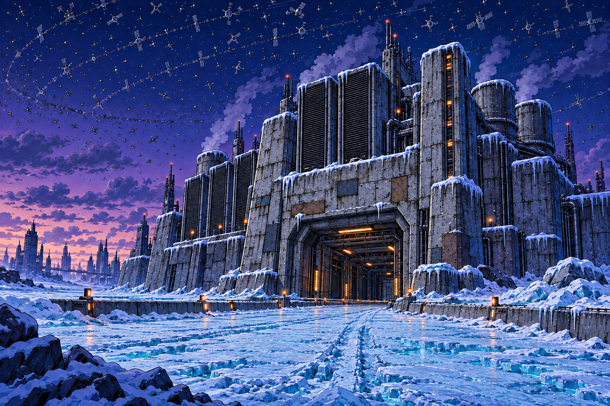
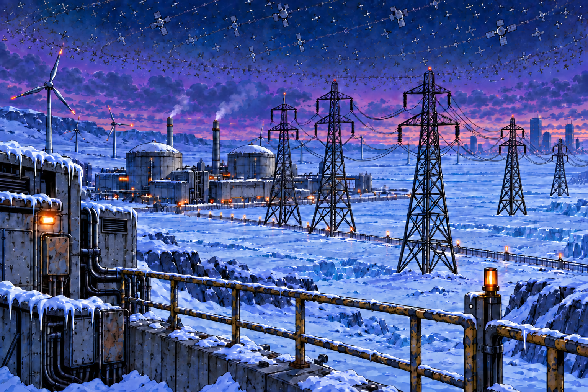
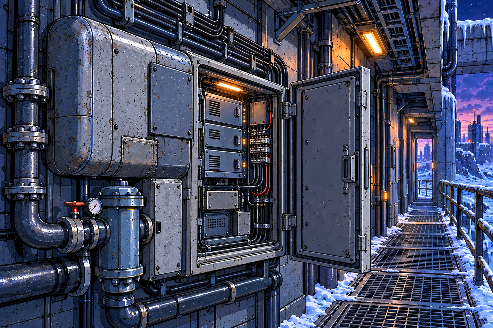
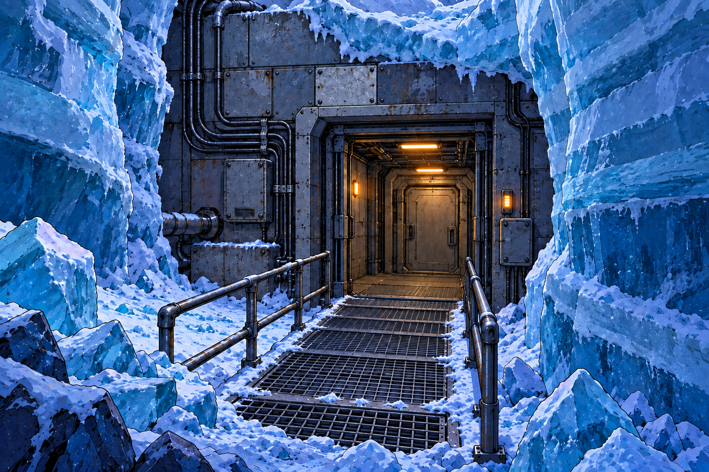

> Importiertes Entstehungsprotokoll vom 2026-09-14. Zeitgebundene Aussagen wie „noch nicht im Repo“ beschreiben den damaligen Stand. Aktuelle Auswahl und Handoffs stehen in den Designakten. Lokale Links wurden bei der Übernahme angepasst; Prompts bleiben inhaltlich erhalten.

# Human Park — Earth-Stilleitfaden
## Entwurf v0.1 · 14. September 2026

| Feld | Festlegung |
|---|---|
| Style ID | human-park-earth |
| Stilfamilie | Konturbetonter, farbiger Industrie-Comic |
| Designstatus dieses Leitfadens | EXPLORATION — zur Prüfung |
| Grundlage | Vier im Gespräch ausgewählte Referenzen, jeweils SELECTED |
| Stilwirkung | strong innerhalb der hier beschriebenen Earth-Umgebungen |
| Anwendung | Umgebungsentwicklung und spätere visuelle Kontinuität der gegenwärtigen, vereisten Earth-Schauplätze |
| Verträge | comic-design-standard-v1; narrative Grundlage comic-project-standard-v1 |
| Transformation Profile | keines aktiv |

**Die Erde arbeitet weiter.** Ihre Infrastruktur wirkt alt, benutzt und wiederholt repariert. Kalte Landschaften umgeben kleine, weiterhin funktionierende technische Bereiche. Die Bilder vermitteln lange Betriebsdauer durch Material und Konstruktion.

Dieser Leitfaden ist ein **neuer Regelentwurf aus ausgewählten Bildern**. Die Zustimmung zu den Bildern gibt nicht automatisch jede hier abgeleitete Regel frei. Die Bildauswahl ist im Gespräch dokumentiert, noch nicht im Projekt-Repo. Das Repo `dcomics-human-park` bleibt die Source of Truth; dieses Dokument bereitet eine spätere Übernahme vor.

## 1. Die vier ausgewählten Referenzen

### E-01 · Rechenzentrum B — SELECTED

**Übernehmen:** kräftige Konturen, klare Schattenflächen, kalte Gesamtpalette, sparsame warme Betriebslichter; monumentale Technik mit sichtbaren Reparaturen. Hohe Detaildichte mit erkennbaren großen Baukörpern.

**Referenzrollen:** Stil, Palette, Linie, Material, Außenarchitektur und Tiefenwirkung.

**Nicht automatisch festlegen:** identische Fassaden für alle Gebäude, konkrete Funktion jedes sichtbaren Aufbaus, Form und genaue Verteilung der Satelliten. Das Bild ist keine maßstäbliche Bauzeichnung.

### E-02 · Energieversorgung im Eis V4 — SELECTED

**Übernehmen:** weite Eisflächen, visuell nachvollziehbare Verbindung von Energieversorgung und Recheninfrastruktur, räumlich gestaffelte Details.

**Im Gespräch korrigiert:** Strommasten müssen im Verhältnis zur Umgebung ausreichend groß sein und in der Tiefe nachvollziehbar kleiner werden. Die Reihe wurde auf fünf sichtbare Masten reduziert, um die Landschaft zu öffnen.

**Referenzrollen:** Landschaft, Maßstab, Komposition, Infrastruktur und Fernwirkung.

**Nicht automatisch festlegen:** fünf Masten in jeder Earth-Ansicht. Die konkrete Anzahl gilt für diese Bildfassung. Heutige Kraftwerks- und Windradformen sind eine ausgewählte Bildlösung, keine allgemeine Vorschrift für die gesamte Erde. Die Ansicht ist keine technische Netzplanung.

### E-03 · Wartungsbereich V1 — SELECTED

**Übernehmen:** erreichbare Wartungspunkte, austauschbare Module, erkennbare Kabelwege, Verschraubungen, Flansche und mechanische Anschlüsse. Warmes Funktionslicht sitzt an tatsächlich genutzten Bereichen.

**Referenzrollen:** Material, technische Nahsicht, Beleuchtung und Gebrauchsspuren.

**Weiter prüfen:** Austauschbauteile dürfen sich deutlicher vom alten Gehäuse unterscheiden. Die geöffnete Schranktür braucht genügend Arbeits- und Durchgangsraum.

**Nicht automatisch festlegen:** jeder Schrank steht offen; jede Fläche ist gleich stark korrodiert; dieser Bereich gehört bereits räumlich zur Fundanlage.

### E-04 · Zugang zur Fundanlage V2 — SELECTED

**Übernehmen:** Kontrast zwischen kaltem Schichteis und warmer technischer Vorzone; klare Führung zur Tür; geschlossene innere Grenze zum eigentlichen Anlagenbereich.

**Im Gespräch korrigiert:** rechtes Geländer entlang der Stegkante zur rechten Eingangsseite führen. Der Durchgang bleibt frei.

**Referenzrollen:** Übergang Außen/Innen, Eis, Material, Licht und Zugangskomposition.

**Narrative Grenze:** Freilegung nach der Entdeckung, Steg und Türfolge sind PROPOSAL. SELECTED bezeichnet die visuelle Richtung, nicht die Bestätigung dieser Zugangsgeschichte. Das Bild legt weder ursprünglichen Zugang noch Tiefe der Anlage fest.

## 2. Narrative Leitplanken

Die folgenden Grundlagen kommen aus dem Projekt, insbesondere `project.md`, `design-project.md`, `canon/series-bible.md`, `canon/timeline.md` und den Originaltexten von Heft 1 und 2:

- **CANON:** Die Erde gilt als verlassen, besitzt aber weiter betriebene Rechenzentren, Energieanlagen und Wartungssysteme.
- **CANON:** Eine dichte Hülle aus Satelliten, Relaisstationen und Archivmodulen umgibt sie und verdunkelt Teile der Erde.
- **CANON:** Die unterirdische Anlage wurde durch Bohrungen im ewigen Eis entdeckt. Ihre technischen Systeme funktionieren weiter; die fünf Kryokammern sind wesentlich jünger als das Labor.
- **CANON:** B-21 wartete die Fundanlage allein und blieb bei ihrer Entdeckung unentdeckt. Er kam heimlich mit dem Kryotransport zum Mars. B-73 kennt dieses Geheimnis nicht.
- **OPEN:** ursprünglicher Auftrag und Dauer von B-21s Tätigkeit; wesentliche Hintergründe der Kryokonservierung.
- **PROPOSAL:** genaue Geometrie, Baugeschichte und Materialanordnung der neuen Bildentwürfe, soweit nicht bereits durch Story-Quellen belegt.

Die vereisten Motive definieren keinen lückenlosen globalen Klimaatlas. Aus der Palette folgt weder ewige Nacht an jedem Ort noch eine bestätigte Ursache der Vereisung. Eine direkte räumliche Verbindung der vier Bilder ist noch nicht festgelegt.

## 3. Operative Gestaltungsregeln — Entwurf

| Bereich | Arbeitsregel |
|---|---|
| Linie | Außenkonturen stärker als innere Konstruktionslinien. Bauteile zuerst durch Silhouette und große Unterteilungen lesbar machen. Feine Linien erklären Anschlüsse, Fugen und Reparaturen. |
| Farbe | Stahlblau und Kobaltblau bilden große Flächen; Cyan trennt Eis und kaltes Licht, Violett vertieft Schatten und Ferne. Amber markiert einzelne aktive Bereiche. Keine verbindlichen HEX-Werte aus den Bildern ableiten. |
| Licht | Lichtquellen sind lokal nachvollziehbar: Leuchten, Fenster, Anzeigen. Kaltes Außenlicht und warme technische Bereiche bilden den Hauptkontrast. Helligkeit darf für Innenräume und Tageszeiten variieren. |
| Schatten | Klare, zusammenhängende grafische Schattenformen. Weiche Atmosphäre vor allem für Entfernung; sie ersetzt nicht die Konturzeichnung am Hauptmotiv. |
| Formen | Robuste Gehäuse, verständliche Öffnungen, klare Träger und Verbindungspunkte. Runde Ecken und rechteckige Austauschplatten dürfen unterschiedliche Bauphasen ausdrücken. |
| Metall | Lackabrieb an Kanten und Griffstellen; Korrosion an plausiblen Fugen. Neuere Abdeckungen und Befestigungen unterscheiden sich erkennbar, bleiben technisch kompatibel. |
| Eis | Schichtung, Bruchkanten und Schneeauflagen unterscheiden. Eis rahmt oder verdeckt alte Architektur. Kontrolliert betriebene Innenbereiche nicht ohne erzählerischen Grund mit Schnee füllen. |
| Detail | Höchste Dichte am erzählerisch wichtigen Bauteil, mittlere Dichte im Nahraum, vereinfachte Fernformen. Ruhige Flächen zwischen den Detailgruppen erhalten. |
| Maßstab | Größen aus gemeinsamem Raum und Vergleichsobjekten ableiten. Gleiche Bauteiltypen dürfen nicht ohne räumlichen Grund sprunghaft ihre Größe wechseln. |
| Technik | Leitungen verbinden erkennbare Anschlüsse. Türen, Handläufe und Wartungsöffnungen respektieren Bewegungs- und Arbeitsraum. Funktionalität muss im Bild plausibel sein; exakte Technik wird separat ausgearbeitet. |
| Komposition | Ein klarer Schwerpunkt je Ansicht. Wege, Kabeltrassen und Licht lenken dorthin. Wiederholte Elemente nur so dicht setzen, dass Landschaft und Handlung lesbar bleiben. |

### Konsistenzanker

Bei jeder neuen Ansicht sollten diese Eigenschaften wiedererkennbar bleiben:

1. Kalte dominante Farbflächen mit begrenzten warmen Betriebspunkten.
2. Kräftige Comic-Konturen und grafische Schatten.
3. Funktionierende, über lange Zeit gepflegte Infrastruktur.
4. Reparaturen, deren Lage und Ausführung nachvollziehbar sind.
5. Eine erkennbare Hierarchie aus Hauptmotiv, Umgebung und Ferne.
6. Nutzbare Zugänge und glaubwürdige Größenverhältnisse.

### Erlaubte Variation

Unterschiedliche Baualter, Gehäuseformen, örtliche Reparaturmethoden und Detailmengen sind erwünscht. Innenräume dürfen wärmer sein; einzelne Geräte dürfen kleine andere Signalfarben tragen. Monumentale Außenansichten und enge technische Nahsichten gehören zur selben Richtung.

Satelliten müssen nicht in jedem Bild sichtbar sein. Auch Schnee, offene Schränke, sichtbare Roststellen und Geländer sind keine Pflichtmotive. Die Funktion des jeweiligen Ortes entscheidet.

### Vermeiden

- Flächendeckenden Rost oder Trümmer als pauschales Zeichen für Alter.
- Reine Schmuckleitungen ohne erkennbare Verbindung.
- Überfüllte Reihen aus Masten, Antennen oder technischen Details.
- Größenfehler, unmotivierte Perspektivsprünge und blockierte Eingänge.
- Dauerhaft leuchtende Fantasieenergie statt konkreter Betriebstechnik.
- Einen überall identischen Dämmerungshimmel als starre Stilregel.
- Neue Symbole, Fähigkeiten oder historische Aussagen ohne Kennzeichnung als Vorschlag.

## 4. Figuren im Earth-Stil

Die Umgebungsrichtung ändert keine Charakteridentität.

Für B-21 gelten weiterhin seine Projektakten und Charakterreferenzen: klein und gedrungen, graues vernietetes Gehäuse, gelbe Augen, sichtbare Reparaturen; getrennt geführtes älteres Equipment. B-73 bleibt groß und aufrecht, orange-cremefarben mit türkisfarbenen Funktionsanschlüssen und integriertem Modulsystem.

Figuren können die Beleuchtung der Umgebung aufnehmen, müssen aber in Silhouette und Eigenfarben lesbar bleiben. Die Roboter und Geräte der ursprünglichen `earth-01/02/03.png` werden gemäß `design-project.md` ignoriert.

Eine Darstellung B-73s in der früheren Fundanlage oder eine gemeinsame Erd-Vergangenheit mit B-21 ist nicht durch die bisherigen Quellen gedeckt. Zukünftige Figurenszenen benötigen einen definierten Zeitpunkt und Story-Kontext.

## 5. Offene Entscheidungen vor der Fundanlagen-Ausarbeitung

| Entscheidung | Aktueller Stand | Zuständigkeit |
|---|---|---|
| Ursprünglicher Zugang vs. Zugang nach Entdeckung | Neuer Freilegungsweg ist PROPOSAL | Story-Funktion klären, dann Environment Designer |
| Tiefe, Geschosse und Wegführung | OPEN | Environment Designer innerhalb der Story-Vorgaben |
| Verbindung zum Wartungsbild | E-03 ist bislang Material-/Stilreferenz, kein bestätigter Raum der Fundanlage | Story und Environment Designer |
| Zeitliche Situation | E-04 schlägt Zustand nach Entdeckung vor; Ausbaugrad und Zeitpunkt offen | Story |
| Kryoraum | Fünf jüngere Kammern sind vorgegeben; Aussehen und Anordnung offen | Environment Designer mit Story-Constraints |
| Materialgenerationen | Unterschiedliche Reparaturalter sichtbar machen; keine konkrete Datierung festgelegt | Design; Datierungen an Story zurückgeben |
| Satellitendarstellung | Dichte Hülle als Weltfakt, sichtbare Größen und Darstellung noch nicht verbindlich | Style Director / Environment Designer |

## 6. Handoff und Prüfkriterien

**Comic Style Director:** diesen Earth-Regelentwurf anhand der vier ausgewählten Bilder abstimmen. Eine spätere Freigabe sollte ausdrücklich den Earth-Geltungsbereich benennen.

**Comic Environment Designer:** anschließend eine einfache Raumskizze der Fundanlage als PROPOSAL erstellen. Zugang → technische Vorzone → Wartungsbereich → Kryoraum ist eine mögliche Arbeitsfolge, noch kein bestätigter Grundriss. Schwellen, Türen, Durchgangsbreiten und relevante Sichtachsen zuerst klären; daraus zusammenhängende Ansichten ableiten.

**Story-Seite:** Funktion, Zeitpunkt, Entdeckungsgeschichte und neue technische Fähigkeiten beurteilen. Designentscheidungen werden nicht stillschweigend zu CANON.

**Production:** erhält später ausdrücklich freigegebene Referenzen, Stilversion und Kontinuitätsanker. SELECTED-Bilder sind keine automatisch freigegebenen finalen Panels.

Vor einer weiteren Auswahl prüfen:

- Ist das Motiv auch verkleinert eindeutig lesbar?
- Stimmen Maßstab, Tiefenstaffelung und Anschlüsse?
- Bleiben Türen, Wege und Wartungsflächen nutzbar?
- Zeigt die Alterung Pflege und Erneuerung?
- Passt die Ansicht zu B, V4, Wartung V1 und Zugang V2?
- Sind neue Story-Annahmen ausdrücklich markiert?

## 7. Vorgeschlagene Ablage bei späterer Übernahme

Noch keine Dateien im Projekt ändern. Geeignete Zielstruktur im Projekt wäre:

- `design/styles/human-park-earth/style.md` — dieser abgestimmte Leitfaden.
- `design/environments/earth/design.md` — Referenzrollen, Auswahlstatus und offene Ortsfragen.
- `design/environments/earth/references/` — ausgewählte neue Bilder plus knappe Herkunfts-/Versionsnotizen; bestehende Earth-Bilder erhalten.
- `design-project.md` — Earth-Stil und aktuelle Auswahl verknüpfen; Mars- und Modulia-Konfiguration erhalten.

Frühere Varianten nicht automatisch löschen, archivieren oder zu SUPERSEDED erklären. Der leere Altbestand `style/visual-style.md` wird nicht automatisch migriert.

## Frameworkgrundlage

Arbeitslogik: `comic-framework-design/skills/comic-style-director`, insbesondere Referenzinterpretation und Style Direction Protocol. Schema: `visual-style-schema.md` und `style-pack-schema.md`.

Narrative Statusregeln: `comic-framework-story`. Modulgrenzen und Übergaben: `comic-framework-docs/docs/framework-boundaries.md` und die Handoff-Dokumente.

Dieses Dokument enthält keine neue Projektfreigabe, keinen Commit und keine Übernahme ins Projekt-Repo.

